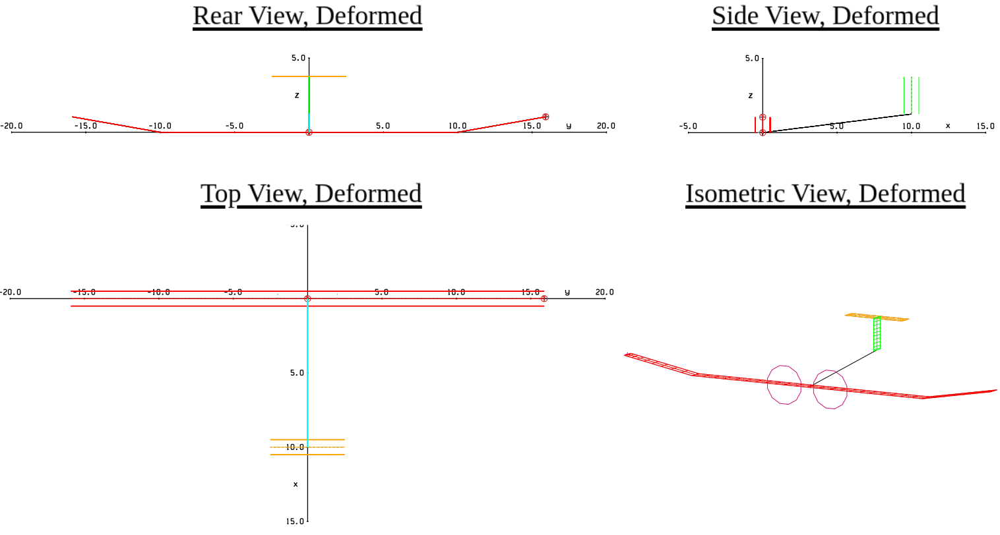
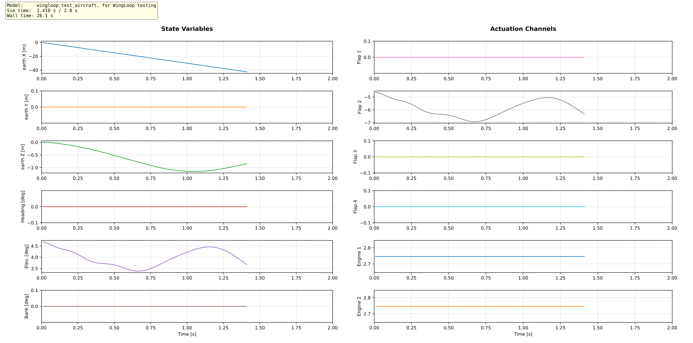
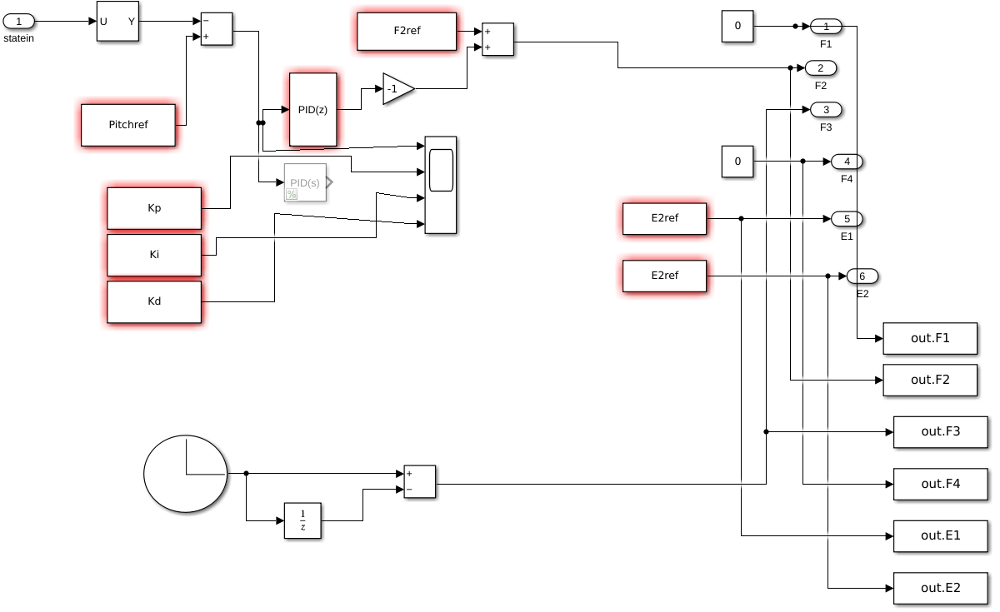

## WingLoop 2.0
<div align="center">
  
</div>

**Author:** Leonardo Avoni  
**Contact:** avonileonardo@gmail.com  
**Last Modified:** 10/03/2026  
**Platform:** Ubuntu  
**Tested with:** ASWING 5.98  

---

## Overview

WingLoop is a closed-loop control framework that extends the capabilities of [ASWING](https://web.mit.edu/drela/Public/web/aswing/), a structural and aerodynamic analysis tool for flexible aircraft. While ASWING natively supports only linear bi-scheduled controllers, WingLoop integrates ASWING with Python — and optionally MATLAB or Simulink — to enable arbitrary control laws, including nonlinear strategies.

The simulation advances in a time-marching loop, either step by step or in chunks of *K* timesteps. Between iterations, the simulation state is passed to Python — and then to MATLAB or Simulink if needed — where the control laws are computed. The resulting control inputs are returned to ASWING for the next timestep, enabling closed-loop simulations with arbitrary controllers.

### Reference Publication

> Leonardo Avoni, Murat Bronz, Jean-Philippe Condomines and Jean-Marc Moschetta.  
> *"Enhancing ASWING Flight Dynamics Simulations with Closed-Loop Control for Flexible Aircraft,"*  
> AIAA 2025-3425. AIAA AVIATION FORUM AND ASCEND 2025. July 2025.  
> https://arc.aiaa.org/doi/10.2514/6.2025-3425

---

## Installation

From the `02_WingLoop` folder, run:

```bash
pip install -e .
```

After installation, the following imports will be available:

```python
from WingLoop_Library import Aswing_Director
from WingLoop_Library import WingLoop
```

---

## Repository Structure

```
WingLoop_Library/
├── Aswing_Director.py          # Communicates with ASWING (sends commands)
├── WingLoop.py                 # Main loop director — orchestrates the full WingLoop execution
├── PyControl.py                # Handles control logic: receives states and dispatches to control laws
├── PyControl_IO.py             # Reads ASWING state files; writes control input files for ASWING
├── PyControl_Plot.py           # Real-time and post-run plotting utilities
├── PyControl_additional.py     # Legacy code from earlier WingLoop versions
├── __init__.py
│
├── test_files/
│   ├── readme
│   ├── test_aircraft/
│   ├── test_controllers/
│   │   ├── matlab/
│   │   ├── python/
│   │   ├── simulink/
│   └── test_output/
│
└── wingloop_testrun/
    ├── results/                # containing PID testing results
    ├── aswing_geometry/
    ├── matlab_controller/
    ├── python_controller/
    ├── simulink_controller/
    └── wingloop_testrun.py
```

---

## Library Components

| Module | Description |
|---|---|
| `WingLoop.py` | Top-level director of the WingLoop execution loop |
| `Aswing_Director.py` | Interface to ASWING; sends commands to the simulator |
| `PyControl.py` | Receives aircraft states from ASWING and dispatches to control laws (Python, MATLAB, Simulink) |
| `PyControl_IO.py` | I/O utilities: reads ASWING state files, writes control input files |
| `PyControl_Plot.py` | Plotting utilities for real-time monitoring and post-run analysis |
| `PyControl_additional.py` | Legacy utilities from earlier versions |

Further details on each module are available in the header of the respective source file. Individual modules can also be run and tested independently via their `__main__` block.

---

## Supported Controller Types

- **Python** — native Python control laws
- **MATLAB** — via MATLAB's Python API
- **Simulink** — via FMU export or MATLAB/Simulink API

---

## WingLoop TestRun

The `wingloop_testrun` case is designed to assess WingLoop's behavior and performance across all supported controller types. A simple PID controller is applied to the aircraft shown below, featuring 4 groups of control surfaces and two engines. The same controller is implemented in five different ways: Python, MATLAB, Simulink, compiled Simulink (FMU), and ASWING's native controller format. All ASWING-relevant files (trimming state, gust file, ASWING controller file, etc.) are located in the `aswing_geometry` folder.

<div align="center">
  
  <p><em>Test aircraft configuration</em></p>
</div>

To run the test case:

```bash
cd WingLoop_Library/wingloop_testrun
python wingloop_testrun.py
```

<div align="center">
  
  <p><em>WingLoop GUI during a simulation run</em></p>
</div>

A sample `.json` output from a completed run is available [here](docs/wingloop_test_aircraft.json).

> **Note on the ASWING-native case:** when using the ASWING built-in controller, WingLoop is bypassed entirely — the controller is integrated directly within the ASWING execution. Results are equivalent to the WingLoop cases, with the exception of a one-timestep lag inherent to the WingLoop coupling method.

### Scenario

The controller objective is to stabilize the aircraft in response to a 1-cosine gust.

**Flight conditions:**
- Leveled, horizontal flight at $V_{\infty} = 30\ \mathrm{m/s}$
- 1-cosine vertical gust (frozen-flow) applied as perturbation: distance to gust start −15 m, gust zero-to-peak distance 15 m, peak vertical velocity 3 m/s

**Simulation parameters:** $N = 300$, $K = 1$, $\Delta t = 0.01\ \mathrm{s}$ — plot refresh every 1 s

**PID gains:** $K_P = 100\ \mathrm{[deg/rad]}$, $K_I = 100\ \mathrm{[deg/(rad \cdot s)]}$, $K_D = 20\ \mathrm{[deg \cdot s/rad]}$

### Test Machine

Benchmarks were collected on the following machine, running only VSCode and ASWING in the background:

| | |
|---|---|
| **Model** | Dell Inc. Precision 3581 |
| **RAM** | 32.0 GiB |
| **CPU** | 13th Gen Intel® Core™ i7-13800H × 20 |
| **GPU** | NVIDIA Corporation / Mesa Intel® Graphics (RPL-P) |
| **Storage** | 1.0 TB |
| **OS** | Ubuntu 22.04.5 LTS |


> Timing results are machine-dependent and will vary on different hardware.

### Performance Results

Timing is split into two categories:

- **Overhead time** — one-off startup cost (WingLoop initialisation, MATLAB engine startup, FMU compilation, etc.)
- **Computational time** — wall-clock time to complete all $N$ iterations

**Baseline — ASWING with native controller (no WingLoop):**

| Overhead | Computational time |
|---|---|
| — | 10.70 s |

**WingLoop results by controller type:**

| Controller | Plot ON [s] | Δ Plot ON | Plot OFF [s] | Δ Plot OFF | Overhead [s] |
|---|---|---|---|---|---|
| Python                        | 15.01 | +40.3% | 11.73 |  +9.6% |  0.49 |
| MATLAB                        | 15.94 | +49.0% | 12.92 | +20.7% |  2.95 |
| Simulink (With GUI)                      | 138.0 | +1190% | 137.3 | +1183% | 18.58 |
| Simulink (Without GUI)                      | 105.0 | +881% | 91.06 | +751% | 13.51 |
| Simulink FMU (recompiled then run)     | 14.64 | +36.8% | 11.98 | +12.0% | 26.50 |
| Simulink FMU (non-recompiled then run) | 14.88 | +39.1% | 11.87 | +10.9% |  0.53 |

*Δ columns show computational time increase relative to the ASWING baseline (10.70 s). These are* ***not*** *official benchmarks — they give a rough sense of the relative cost of each integration approach. Since computational time scales linearly with* $N$*, the per-iteration cost can be estimated by dividing by* $N = 300$*.*

> Note how Simulink FMU compilation takes overhead time, but allows faster simulink execution, very close to Python controller performance. Note also how updating the life WingLoop plots makes simulation slower.
For speed advice: if the controller is simple, choose Python or Matlab. If you absolutely need Simulink, you can use the non-FMU version to check if the controller works as intended, and the compiled FMU for speed.

---
## Rules for Writing a Simulink Controller


As a reference, the example controller in the `simulink_controller` folder demonstrates
all of the above rules. Its block diagram is shown below. Note that this controller has no
physical meaning and was written purely to exercise and validate the WingLoop–Simulink
interface.

<div align="center">
  
  <p><em>Block diagram of simulink_test_controller.slx.</em></p>
</div>

The following rules must be respected when writing a Simulink controller for WingLoop:

**Solver settings** (Model Settings → Solver → Solver Selection):
set the solver type to "Fixed-step" and the solver to "discrete (no continuous states)".
The fixed-step size can be left as `-1` (auto/inherited) — WingLoop will enforce its own
timestep `Dt` at runtime.

**Use discrete blocks only.** Continuous blocks are incompatible with the discrete solver
and will cause errors or incorrect results.

**Retrieving the current timestep** inside the model: use a Clock block, feed it into a
Unit Delay, and subtract the Unit Delay output from the Clock output. The result equals
the current simulation timestep `Dt`.

**Derivative filter coefficient `N`** (relevant for any block with a derivative term,
such as the Discrete PID): always use a filtered derivative. The filter pole is located
at `1 - N·Dt`, so `N·Dt > 1` places it outside the unit circle and causes instability
even when an equivalent Python or MATLAB controller is stable.

Validation tests across Dt = {2×10⁻², 1×10⁻², 5×10⁻³} s show that `N·Dt = 1.0`
produces identical results across all WingLoop controller backends (Python, MATLAB,
Simulink, and FMU), and is therefore the recommended value. Choosing `N·Dt > 1.0`
leads to unstable Simulink behavior.

It is strongly recommended to parameterise `N = 1.0 / Dt` inside `UserController.m`
rather than hardcoding a numerical value in the `.slx` file. This ensures that `N`
is always consistent with whatever timestep `Dt` is set in WingLoop, with no manual
edits to the Simulink model required.

**Inputs:** place a single Inport block named `statein`. This receives the full WingLoop
state vector at each timestep.

**Outputs:** for each control command, add both:
- an Outport block, and
- a To Workspace block pointing to the same signal,

using ASWING-compatible signal names (e.g. `F1`, `F2`, `E1`, `E15`). Both are required:
the Outport is used by WingLoop to read the controller output, and the To Workspace block
enables signal logging and inspection in the Simulink workspace.

**Workspace variables:** blocks that reference MATLAB workspace variables (gains, lookup
tables, filter coefficients, etc.) do not need those variables to exist inside the `.slx`
file itself. Any variable your Simulink model needs must instead be declared and pushed to
the MATLAB base workspace inside `UserController.m`, using `assignin('base', ...)` in the
constructor. WingLoop guarantees that `UserController.m` is executed before the first
`sim()` call, so all variables will be available when Simulink runs.


---
## License

WingLoop is licensed under **[CC BY-NC-SA 4.0](https://creativecommons.org/licenses/by-nc-sa/4.0/)** — free for non-commercial use with attribution.

**Commercial use is not permitted under this license.** If you wish to use WingLoop in a commercial context, please contact the author to discuss a separate agreement:
**Leonardo Avoni** — avonileonardo@gmail.com

If you use WingLoop in academic work, please cite:
> Leonardo Avoni, Murat Bronz, Jean-Philippe Condomines and Jean-Marc Moschetta.
> *"Enhancing ASWING Flight Dynamics Simulations with Closed-Loop Control for Flexible Aircraft,"*
> AIAA 2025-3425. AIAA AVIATION FORUM AND ASCEND 2025. July 2025.
> https://arc.aiaa.org/doi/10.2514/6.2025-3425

See [`LICENSE`](LICENSE) and [`CONTRIBUTING.md`](CONTRIBUTING.md) for full details.
